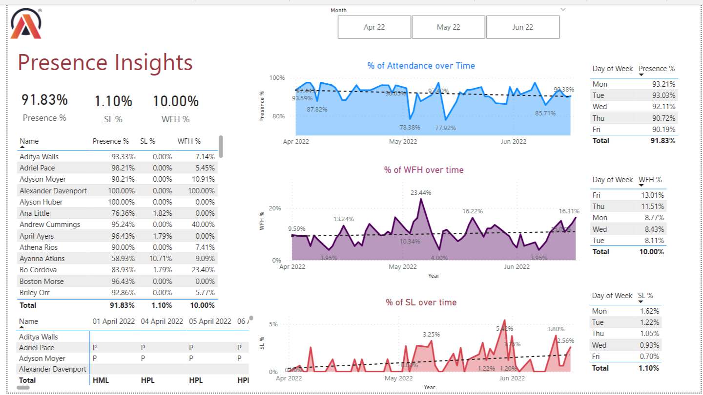
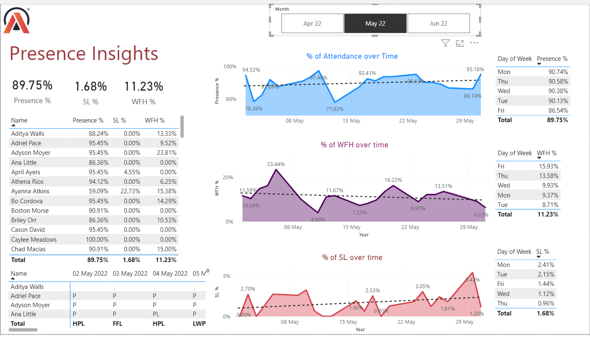
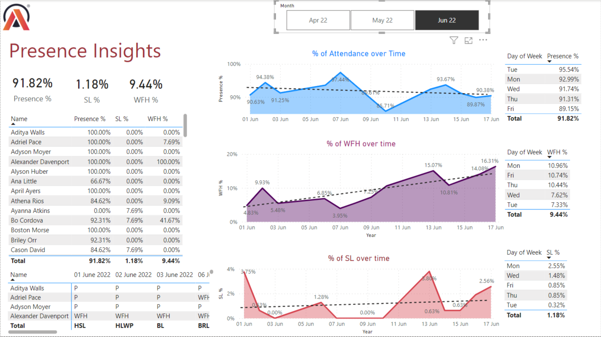

**HR Data Analytics** was a real-world project involving the analysis of employee data and their attendance records at Atliq Company. The HR department often faced challenges in managing a large Excel file containing extensive and disorganized records, leading to a cumbersome process.

At the end of each month, the HR team had to handle various tasks, such as determining the number of absences, calculating the total number of days an individual was absent, tracking the number of employees who opted for work-from-home, recording sick leave instances, monitoring the frequency of half-day attendance, and accounting for weekly off and holiday offs.🤯

To address these challenges, the HR Data Analytics project focused on streamlining the process through efficient data analysis using PowerBI for insightful dashboarding.

PowerBI will give us special features to use for visualizing and analyzing the HR data. The dashboarding capabilities of PowerBI allow us to create interactive and visually appealing charts, graphs, and reports, making it easier to understand and interpret the data. With PowerBI, I generated insightful visualizations such as attendance trends, absenteeism rates, WFH utilization, sick leave patterns, half-day attendance distribution, and the impact of weekly off and holiday offs on employee presence.

After conducting thorough preprocessing, the HR Data Analytics project obtained a finalized dataset that was ready for primary data visualization insights. This dataset was carefully prepared to ensure accuracy and reliability in the visualizations generated using PowerBI.

Above are the insights and trends of the total changes observed across the three months (April, May, and June) of 2022. The analysis reveals that the overall attendance rate remained consistent at approximately 91.83% to 92%, indicating a high level of employee presence. Furthermore, the sick leave rate remained relatively low, accounting for only 1.10% of the total recorded absences.

Examining the Weekday tables, it is evident that Monday exhibits the highest attendance rate, indicating that most employees prefer to start the week by being present in the office. On the other hand, Friday shows a significant number of employees opting for work-from-home (WFH), suggesting a desire for an extended weekend and a break from the office environment.

The patterns observed in the Attendance, WFH, and Sick Leave data follow a zigzag pattern, indicating variations in employee presence and absence throughout the three months. These patterns may be influenced by factors such as workload, personal commitments, or individual preferences.

List of Employees with their individual rates of Presence, WFH and Sick Leave.

As well as, Here are the trends and patterns observed in the individual months of April, May, and June.

Indeed, upon analyzing the data, we observe interesting trends in the work-from-home (WFH) rates for the months of May and June:

**May WFH Rate:** May exhibited a higher WFH rate compared to the other two months, indicating a greater preference for remote work during that period. However, despite the increased WFH rate, the trend line suggests a slight decrease in the WFH rate over time. This may indicate a shift in employee preferences or operational changes within the organization.

**June WFH Rate:** In contrast to May, the WFH rate in June was lower. Despite the lower WFH rate, the trend line demonstrates an increasing pattern. This suggests that although fewer employees opted for remote work in June, the proportion of those choosing WFH gradually increased over time.

These contrasting trends indicate the dynamic nature of employee preferences and the flexible work arrangements observed over the analyzed months. HR professionals can utilize this information to better understand and adapt to changing employee needs, ensuring effective workforce management and maintaining a balance between in-office and remote work options.

The WFH rate in May was higher compared to the other two months, indicating a greater preference for remote work during that period. However, despite the increased WFH rate, the trend line suggests a slight decrease in the WFH rate over time.

The implementation of this streamlined HR process and the utilization of this dashboard have resulted in increased efficiency and can save approximately **3-4 hours of work** on a daily basis. The automated insights and data visualization provided by the dashboard significantly reduce the time required for manual data analysis and reporting, enabling HR professionals to focus on more strategic and value-added tasks.

